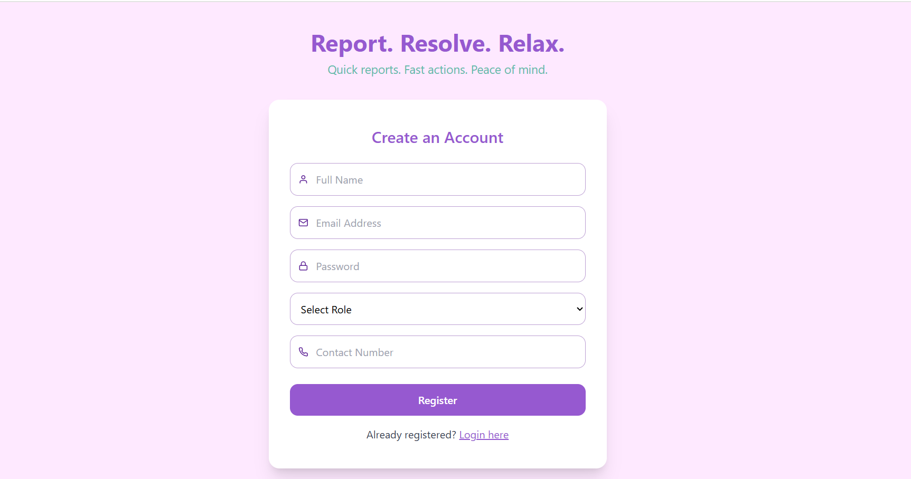
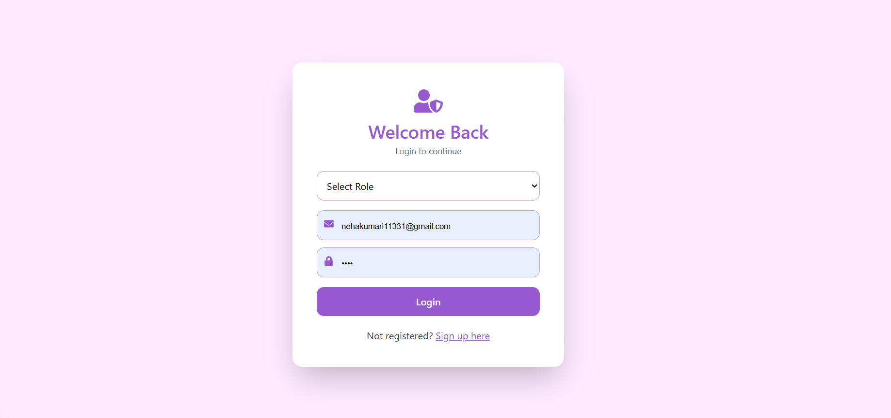
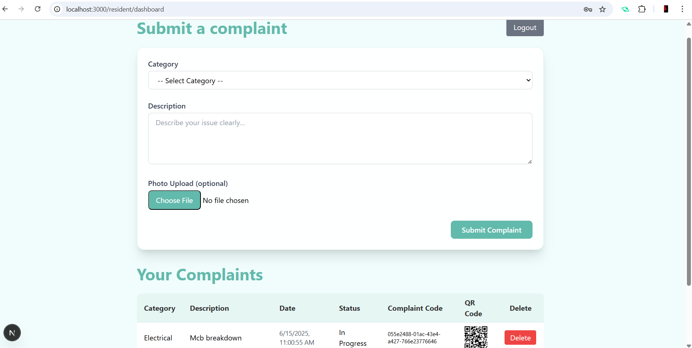
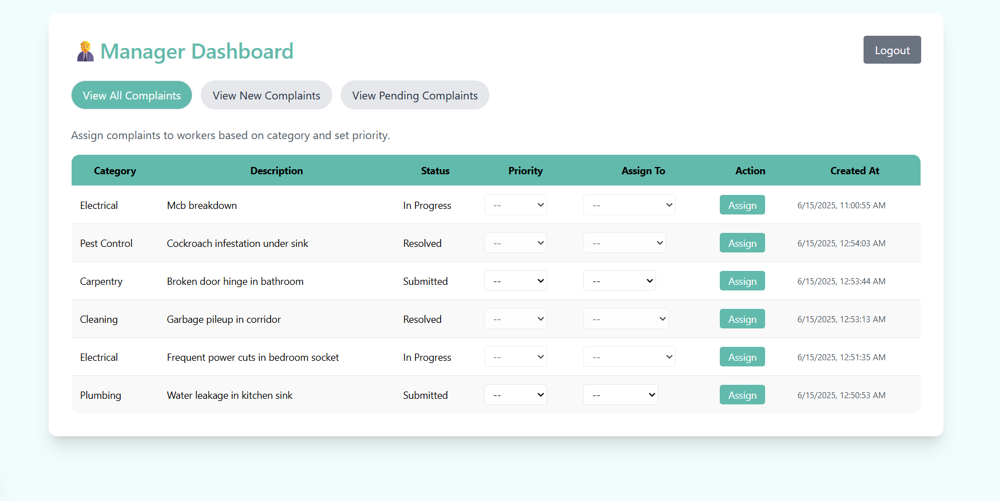

# Resident Complaint Management System

A full-stack web application that enables residents to raise complaints, managers to assign and prioritize them, and workers to resolve issues using a token-based reward system.

---

## 🛠️ Tech Stack

- **Frontend & Backend**: Next.js (App Router)
- **Authentication**: NextAuth.js (Credentials Provider)
- **Database**: MySQL using `mysql2/promise`
- **Styling**: Tailwind CSS
- **Utilities**: bcryptjs, uuid, html5-qrcode


## 👥 User Roles and Features

### 🏠 Resident
- Register and login using Flat Number and Contact Number
- Submit complaints with category, description, image
- Get a unique complaint code and downloadable QR code
- View all submitted complaints and delete if needed

### 🧑‍💼 Manager
- Login via email and password
- View all submitted complaints
- Assign to workers based on category
- Set complaint priority (Low/Medium/High)

### 👷 Worker
- Login via email, password, and specialization
- View assigned complaints (sorted by priority)
- Accept and mark complaints as "In Progress"
- Scan QR to mark as "Resolved"
- Earn tokens per resolved complaint based on priority

### 💰 Token System
- Workers earn:
  - 🟥 5 tokens for High
  - 🟧 3 tokens for Medium
  - 🟩 1 token for Low priority complaints
- View Token Balance
- Redeem Rewards 

---
## 🖼 Screenshots

### Registration page


### Login page


### Resident Dashboard


### Manager Dashboard


### Worker Dashboard with QR Scan


## 📦 Installation

### 1. Clone the repo

```bash
git clone https://github.com/Neha-Kumari2311/complaint-managment-app.git
cd resident-complaint-app

